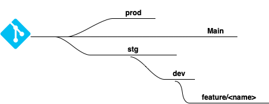

# application Node JS

## Description
Node js application that will be running in an ECS service with Fargate. The application write and read data from a database (RDS postgres). Every branches has its own workflow to deploy the image to a ECR and be tested in AWS.

## Environments

## Workflow
- dev: where you develop your code and test. The image will be deploy with github actions to ECR. Enviroment similar to prod, to be able to find out issues.
- stg: Similar to production. pre costumer releases will be made in this enviroment.
- Prod: Aplication used by customer.

For any new feature a new branch will be created from developed with the next format: feature/<name>
